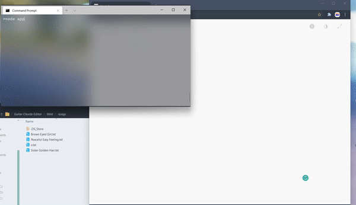

# Guitar-Chords-Editor
Javascript Single Page App

## Intro

This is a small web app that is based on just the native capabilities of Node.js and JavaScript. Enabled read and write files on the server. Users can drag the words and chord symbols around within their browser, and able to upload the revised data back to the server which will then store an updated version of the file.

## Running the tests

To run this project, you do not need to install npm modules…

```
$ cd ../Guitar-Chords-Editor
$ node app.js
```

2. Open a web browser, go to the url address: http://localhost:3000/index.html
3. Enter a song name, then click "Submit Request" button (or press enter)
4. Drag & drop the words and chords on the canvas, and click "Preview" button to see the changes
5. Enter a name and click "Save File" button to save the new file

## Demonstration

